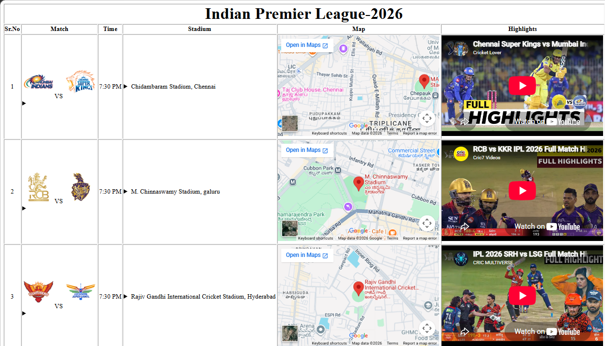
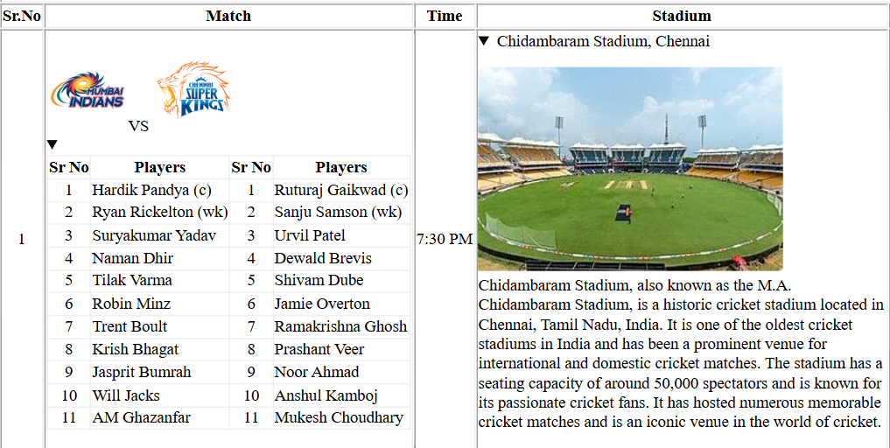

# 🏏 IPL Match Information Website

A static IPL Match Information Website developed using **HTML5** as part of my **Web Technology training at QSpiders**.

This project displays IPL match schedules, team line-ups, stadium details, Google Maps locations, and match highlights in a structured and user-friendly format.

---

## 📖 Project Information

- **Project Type:** Academic Assignment
- **Institute:** QSpiders
- **Course:** Java Full Stack Development – Web Technologies
- **Technology Used:** HTML5
- **Project Status:** Completed

---

## 🌐 Live Demo

🔗 https://vighneshmunde.github.io/IPL-Match-Information-Website/

---

## 📌 Project Overview

The IPL Match Information Website is a static web application designed to present information about Indian Premier League (IPL) matches.

The website allows users to:

- View IPL match schedules
- View playing XI of both teams
- Explore stadium information
- View stadium locations on Google Maps
- Watch match highlight videos through YouTube
- Navigate information in a clean tabular format

---

## ✨ Features

- 🏏 IPL Match Schedule
- 👥 Team & Player Information
- 🏟️ Stadium Details
- 🗺️ Google Maps Integration
- 🎥 YouTube Match Highlights
- 📋 Organized Table Layout
- 📱 Simple and Easy-to-Understand Interface

---

## 🛠️ Technologies Used

- HTML5

---

## 📚 HTML Concepts Used

This project demonstrates the following HTML concepts:

- HTML5 Document Structure
- Headings
- Paragraphs
- Tables
- Table Rowspan & Colspan
- Images
- Hyperlinks
- Lists
- Iframes
- Google Maps Embedding
- YouTube Video Embedding
- Text Formatting Tags
- HTML Attributes
- File Organization
- Relative File Paths

---

## 🎯 Learning Objectives

This project helped me understand:

- Creating structured webpages using HTML
- Designing complex table layouts
- Displaying images
- Embedding Google Maps
- Embedding YouTube videos
- Organizing large amounts of data
- Managing project files efficiently
- Improving webpage readability

---

## 📂 Project Structure

```
IPL-Match-Information-Website/
│
├── index.html
├── images/
│
├── screenshots/
│   ├── 01-home-page.png
│   └── 02-match-details.png
│
└── README.md
```

---

## 📸 Screenshots

### Home Page



---

### Match Details



---

## 🚀 Getting Started

### Clone the Repository

```bash
git clone https://github.com/your-username/IPL-Match-Information-Website.git
```

### Open the Project

Open the project folder.

Double-click

```
index.html
```

or

Open the file using any modern web browser.

---

## 💻 Browser Compatibility

This project works with:

- Google Chrome
- Microsoft Edge
- Mozilla Firefox
- Opera

---

## 📚 What I Learned

During this project I learned:

- HTML page structure
- Working with tables
- Managing webpage layouts
- Using images effectively
- Embedding external content
- Creating informative webpages
- Organizing project folders

---

## 📌 Future Improvements

Possible future enhancements include:

- CSS styling
- Responsive design
- JavaScript interactivity
- Match search functionality
- Team filtering
- Live IPL score integration
- Dark mode
- Mobile-friendly layout

---

## 👨‍💻 Developed By

**Vighnesh Munde**

B.Sc. Computer Science Graduate

Java Full Stack Developer Trainee @ QSpiders

---

## ⭐ Support

If you found this project useful, consider giving it a ⭐ on GitHub.

---

## 📄 License

This project is created for educational and learning purposes.
